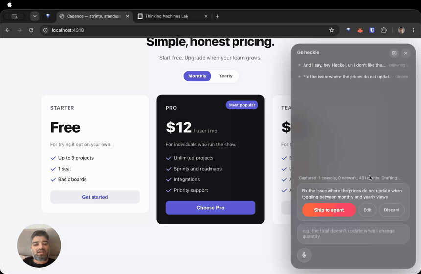

# Heckle

**just say what's wrong. your agent fixes it.**

Heckle is a QA co-pilot for building apps with AI agents. You use your app like a normal person,
and the second something looks off, you just say it (or type it). Heckle turns your words into a
clear task with the console and network details attached, hands it to your coding agent, and waits
for your ok before anything happens. No screenshots. No pasting errors. No writing a paragraph
explaining what you just saw.



**The full walkthrough, with sound:**

https://github.com/user-attachments/assets/90c4477c-784a-49dc-96f6-b2d280018e9f

## why i built this

I build apps with AI agents, and the worst part was the loop. The agent writes the code and then
goes blind the moment I actually use the app. So I would screenshot the bug, paste it back, and type
out what I saw, fifty times a day. I got tired of being a human screen reader for a machine that
should just be watching. So now I talk to my app and my agent fixes it.

## what makes it not annoying

- You talk, you do not fill out a bug report. Say it the way you would say it to a person.
- It grabs the receipts for you: the DOM, the console errors, the network calls, the exact path you
  took. Your agent stops guessing.
- Nothing ships without your ok. Heckle drafts, you read, you hit send. No autonomous chaos.
- You watch it work. After you ship, the task shows a live line of what the agent is doing, then
  lands on Fixed or Didn't land, decided by whether your code actually changed, not a hopeful guess.
- It remembers. What you flagged, what got fixed, what is still open. You never explain the same bug
  twice.
- It is yours and it is private. Runs on your machine, on a local model by default. Nothing leaves.

## what it needs

Runs on macOS, Windows, and Linux. Typing works everywhere; on-device voice is macOS only for now.

- **Node 24 or newer.** Get it from [nodejs.org](https://nodejs.org), or `brew install node` (mac),
  `winget install OpenJS.NodeJS` (windows), `nvm install 24` (linux).
- **A drafting model.** The local-first default is [Ollama](https://ollama.com) with `qwen3:14b`.
  Heckle checks that Ollama and the model are ready, and offers to pull a missing model. You can
  configure an OpenAI-compatible cloud provider instead.
- **A coding agent, optional.** [Claude Code](https://code.claude.com/docs),
  [Cursor](https://cursor.com/install), or Codex (`npm install -g @openai/codex`). Without one,
  every approved task still lands in `.heckle/inbox.md`.

## run it

From the app you want to test:

```bash
npx heckle-dev dev -- npm run dev
```

No clone, global install, or project configuration is required. The npm package is `heckle-dev`;
its installed command is `heckle` if you later install it globally.

On first run Heckle checks Node, Ollama and the configured model, available coding agents, and its
local ports. A missing Ollama model can be pulled from the prompt. For a cloud model, configure it
once with:

```bash
npx heckle-dev config model deepseek deepseek-chat
npx heckle-dev config key deepseek <your-api-key>
```

Cloud drafting sends captured context to that provider and turns local-only mode off. Ollama keeps
capture and drafting on your machine. If no agent is available, delivery falls back to the file
inbox. Nothing reaches any agent until you approve the drafted task.

Open the link Heckle prints (like `http://localhost:4318`). Your app looks the same, with a small
**h** button in the corner.

## how you use it

1. Click the **h** button, or press **Cmd/Ctrl+Shift+.** to talk.
2. Say what is wrong: "the total does not update when I change the quantity."
3. Read the task, edit the wording if you want, hit **Ship to agent**.
4. With an agent connected, it fixes it while you watch, then says **Fixed**. Reload to see it.
5. Without one, the task waits in a file. Tell your agent to "check Heckle," or hit **Run it** on the
   task.

## replay every complaint

Every approved heckle writes a versioned artifact under `.heckle/repros/`. Replays use recorded
network fixtures by default and resolve elements by test id, accessible role and name, then CSS.
Common credential, session, token, password, and email fields are redacted before storage.

```bash
npx heckle-dev replay <repro-id>
npx heckle-dev replay <repro-id> --live
npx heckle-dev test
npx heckle-dev test --changed
```

A dispatched edit is not marked fixed merely because files changed. Heckle runs its repro twice,
promotes it only when both runs pass, and appends the observed assertion delta for one retry when
verification fails. `heckle test` runs promoted repros and exits non-zero on a regression.
`heckle test --changed` uses recorded source mappings when available and safely runs unmapped repros
until the element-to-source map is populated.

Replay runs three times by default. Three passing outcomes pass the determinism gate; any failure
quarantines the repro. Install Chromium once if prompted with `npx playwright@1.61.1 install chromium`.

## instant literal edits

Point at a React element and ask for an obvious copy, color, size, weight, radius, or visibility
change. The rule-first router sends safe literal-only requests through a single-file TypeScript AST
edit, while logic, imports, props, ambiguity, and failed guards fall through to the normal agent
lane. Every instant edit records a deterministic Fix, maps its source surface, adds a replay
assertion, and remains undoable with:

```bash
npx heckle-dev undo
```

The Vite plugin injects dev-only `data-heckle-src` locations into JSX. Next projects can wrap their
config with `withHeckle` from `heckle-dev/next-plugin`; the underlying CommonJS loader is also
exported as `heckle-dev/source-loader`.

## ambient QA signals

Heckle quietly watches local in-page failures while you test: console errors, uncaught exceptions,
unhandled rejections, and same-origin 4xx/5xx requests. It deduplicates variable values into one
fingerprint per route and proposes a reviewable task after two occurrences, or immediately when a
failed request follows a click. The launcher badge shows proposal count without interrupting you.
Promote a proposal into the normal review gate or dismiss it permanently for that fingerprint.

Edit `ambient.ignore` in `heckle.config.ts` to suppress app-specific endpoints. CLS, long-task, and
hydration signals are available under `ambient.performance` and remain off by default.

## agent access over MCP

Heckle exposes the local ledger and replay engine as seven MCP tools over stdio. Register it once
from the project directory:

```bash
claude mcp add heckle -- npx heckle-dev mcp
```

For Cursor or Codex, add an stdio MCP server named `heckle` whose command is `npx` and arguments are
`["heckle-dev", "mcp"]`. Agents can list open issues, pull complete task evidence, search memory,
select and run regressions, run one repro, mark an issue ready for verification, and inspect fix
history. All tool data stays in the project's local `.heckle/` directory.

## which agent fixes it

Claude Code, Cursor, and Codex fix automatically, pick one in the gear. Anything else picks the task
up from a file, so it works with whatever you build with.

## more

Step by step in [docs/getting-started.md](docs/getting-started.md).

For contributors working from source:

```bash
git clone <repository-url>
cd heckle
npm install
npm run build
npm link
```

End users should use `npx heckle-dev`; the source install is only for developing Heckle itself.

## credits

Sriram ([@rbsriram](https://github.com/rbsriram)) and Claude Code. Sriram had the idea and made every
call. Claude did a lot of the typing.

MIT. Use it, fork it, build on it.
